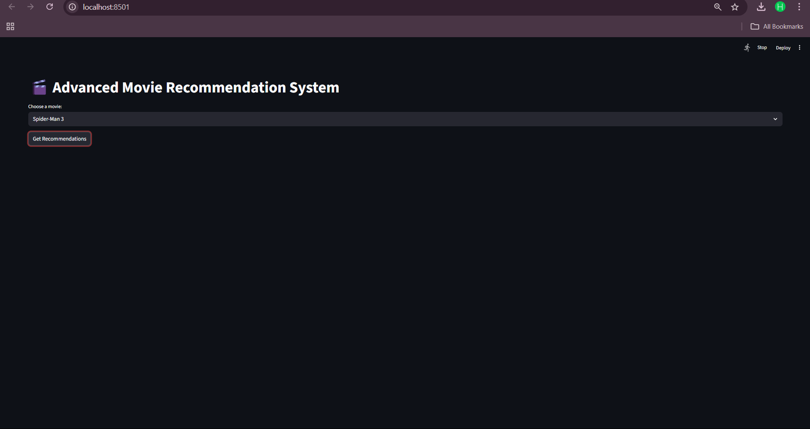
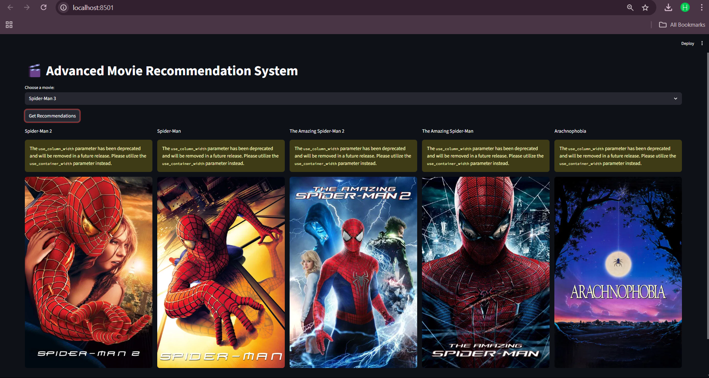
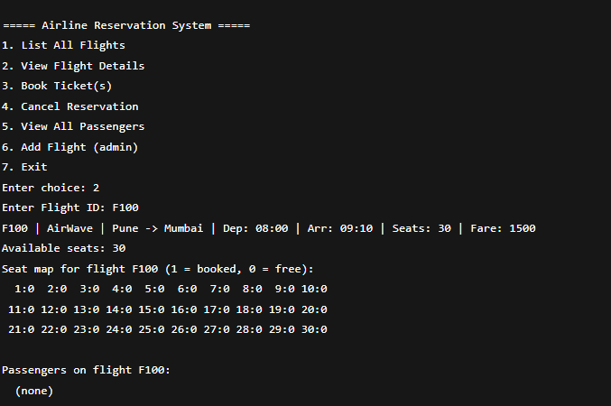

#  Movie Recommendation System

A **content-based recommendation system** built with **Python, Pandas, Scikit-learn, and Streamlit**.  
It suggests similar movies based on genres and description similarity using **cosine similarity**.

---

##  Features
- Content-based filtering using **NLP (CountVectorizer + Cosine Similarity)**
- Simple **Streamlit UI** for user interaction
- Fast and lightweight recommender system
- Easy to extend with more datasets

---

##  Demo Screenshots

### 🏠 Home Page


### 🎥 Recommendations


### 🎥 More Recommendations


---

## ⚙ Installation & Usage

### 1️⃣ Clone the Repository
```bash
git clone https://github.com/harsh8767/Movie-Recommendation-System.git
cd Movie-Recommendation-System
````

### 2️⃣ Install Dependencies

```bash
pip install streamlit scikit-learn pandas requests
```

### 3️⃣ Preprocess Data

Generate the required pickle files:

```bash
python preprocess.py
```

### 4️⃣ Run the Application

```bash
python -m streamlit run app.py
```

---

##  Project Structure

```
Movie_Recommendation/
│── app.py                 # Streamlit application
│── preprocess.py          # Preprocessing & pickle file generator
│── tmdb_5000_movies.csv   # Dataset (movies info)
│── tmdb_5000_credits.csv  # Dataset (movie credits)
│── screenshots/           # UI Screenshots
│    ├── screenshot_home.png
│    ├── screenshot_recommendations.png
│    └── screenshot_recommendations1.png
```

---

##  Notes

* Large files (`similarity.pkl`, `movies_dict.pkl`) are **not pushed** to GitHub due to size limits.
* They are automatically generated when you run `preprocess.py`.

---

##  Future Improvements

* Add **hybrid recommendation** (content + collaborative filtering)
* Deploy on **Streamlit Cloud / Heroku**
* Enhance UI with **movie posters and ratings**

---

 Developed by **Harsh Chavan**

```


